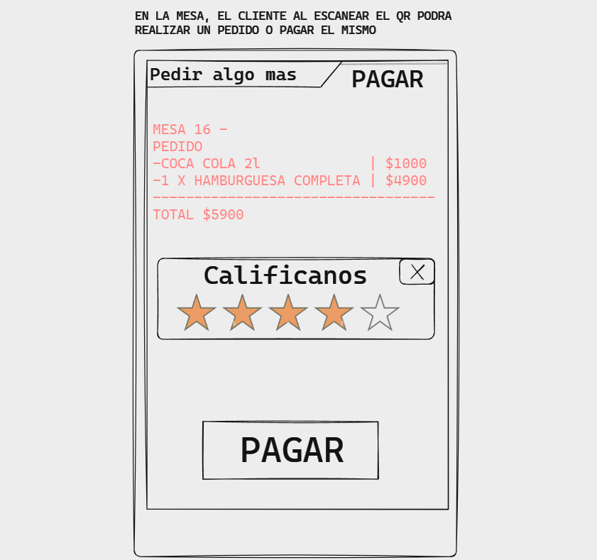

# Sistema de Gestión de Restaurantes por QR

El **Sistema de Gestión de Restaurantes por QR** es una aplicación diseñada para proporcionar una solución eficiente y accesible a negocios gastronómicos de cualquier tamaño. Este sistema permite a los propietarios de restaurantes gestionar sus mesas y pedidos de manera fácil y sin la necesidad de desarrollar un software personalizado o invertir en equipos comerciales costosos.

  

## Características Principales

### Registro del Comercio
- Los dueños de restaurantes pueden registrarse en la aplicación proporcionando información clave, como el nombre del restaurante y la cantidad de mesas disponibles.

  

### Diseño Personalizado de Mesas

- Después del registro, los propietarios tienen acceso a una plantilla donde pueden especificar la cantidad de mesas necesarias y diseñar su disposición según las necesidades de su negocio.

  

### Generación de QR Únicos

- La aplicación genera QR únicos para cada mesa, vinculados a un carrito de pedidos. Estos QR facilitan a los clientes acceder a la carta digital y realizar pedidos.

  

### Gestión de Pedidos

- Los clientes, al escanear el QR de su mesa, pueden acceder a la carta digital, ver los precios de los productos y realizar pedidos.
  
- Los consumidores tienen la opción de realizar pagos en el momento o acumular pedidos durante su estancia para pagar al final de la comida.

  

### Tickets Virtuales y Físicos

- Tras realizar el pago, el sistema emite un ticket virtual para el cliente. Además, se ofrece la opción de obtener un ticket físico convencional que puede retirarse en la caja.

  

<!-- ## Uso de la Aplicación

1. **Registro del Restaurante:**
   - El dueño del restaurante se registra proporcionando información sobre el nombre del restaurante y la cantidad de mesas.

2. **Diseño de Mesas:**
   - El propietario utiliza la plantilla para especificar la cantidad de mesas y diseñar su disposición.

3. **Generación de QR:**
   - La aplicación genera QR únicos para cada mesa, vinculados a un carrito de pedidos.

4. **Pedidos del Cliente:**
   - Los clientes escanean el QR de su mesa para acceder a la carta digital y realizar pedidos.

5. **Gestión de Pedidos:**
   - El sistema acumula los pedidos, mostrando el monto total a pagar. Los clientes pueden optar por pagar en el momento o acumular pedidos.

6. **Tickets de Pago:**
   - Después del pago, el sistema emite un ticket virtual. Los clientes pueden optar por obtener un ticket físico en la caja. -->
